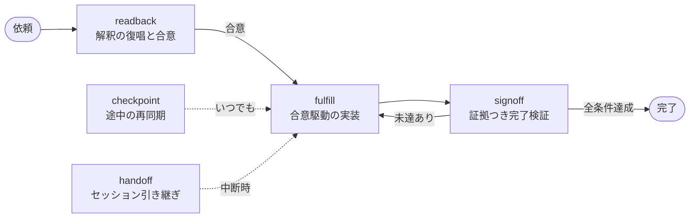

# same-page

ユーザーと AI の**認識のズレ**を開発フロー全体で防ぐプラグイン。

認識のズレは、暗黙の解釈が検証されないまま作業に変換される瞬間に生まれ、発見が遅れるほど手戻りが高くつく。same-page は「解釈」「途中の裁量判断」「完了の主張」という3つのズレ発生点をそれぞれ可視化し、ユーザーが**安価に**検証できる形にする。一方で、すべてを確認するのは認識合わせではなく責任転嫁なので、確認は「ズレたときの被害 × 解釈の分散」でトリアージし、小さな依頼では止まらない。

## 全体フロー



## 使い方

このプラグインは「操作するツール」ではなく「普通に依頼すると自動で効き始める安全網」。覚えることは実質3つ — **普通に依頼する**（readback が自動で走る）、**区切るとき**「今日はここまで」（handoff）、**見失ったら**「今どうなってる？」（checkpoint）。

### 小さな依頼 — 儀式ゼロ

> 「このボタンのラベル、『保存』から『適用』に変えて」

readback は自動起動するが**軽量**判定（局所変更・解釈一意・手戻り数分）になり、質問も合意ファイルもなし。変わるのは着手前に1〜3行の解釈宣言が入ることだけ。

> 「設定画面の保存ボタンのラベル変更と理解して進めます。確認ダイアログ側の『保存』は対象外とします。」

違和感がなければ読み飛ばすだけ。「いや、ダイアログも全部」と**着手前に**止められるのがこの1行の価値。

### 中規模以上の依頼 — リードバックと合意

> 「CSVエクスポート機能を注文一覧にも追加して」

**標準**判定では、リードバック（言い換え＋依頼が言っていない含意の明文化 —「既存実装は同期処理なので、注文も件数が多いと待たされる方式になります」）、やらないことの宣言、最大3問の質問（選択肢＋推奨付き）を経て、合意を `docs/agreements/` に固定してから fulfill が実装する。完了時は signoff が独立検証者（evidence-auditor）で完了条件を1件ずつ実行検証し、**裁量判断の開示**（聞かれなかったが決められていたことを確認する最後の機会）付きで報告する。

影響が横断的・不可逆で方式レベルの解釈が割れる依頼は**重量**判定になり、さらに second-reader（依頼文だけを渡される独立解釈者）との突き合わせで曖昧点を実測してから質問を絞る。

### 実装中の想定外 — 逸脱プロトコル

fulfill は実装中の発見を3レベルで処理する: **L0**（合意が定めない実装詳細 → 進めて台帳に記録、signoff で開示）／**L1**（前提が違ったが完了条件は不変 → 続行して次の報告で必ず言及）／**L2**（やること・完了条件が変わる → **停止**し、事実・影響・選択肢＋推奨・作業ツリーの状態を報告して指示を待つ）。迷ったら停止側に倒す。

### 中断と再開 — セッションを跨ぐ

「今日はここまで」で handoff が会話中の決定を決定台帳に回収し、合意ファイルの「現在地」を書き直す（進捗・次の一手・開いている問題・ハマりどころ）。次のセッションでは SessionStart フックが作業中の合意を自動通知するので、「**昨日の続きやって**」だけで readback が現在地から文脈を復元する。

### 途中で見失ったら

「今どうなってる？」で checkpoint が1画面（目標／確定した決定／進捗／未報告の裁量判断／合意とのズレ／次の一手）を返す。進捗は記憶ではなく git の現物で裏取りされる。読み取り専用なので何度呼んでも安全。

## スキル

| スキル | 役割 | 起動のしかた |
|--------|------|-------------|
| `readback` | 依頼を自分の言葉で言い直し、高リスクの曖昧点だけ質問して合意を固定する | 開発依頼で自動（深さも自動判定）。「認識合わせして」「ちゃんと合意を作って」で深さを引き上げ、`--light`/`--heavy` で強制 |
| `fulfill` | 合意を唯一の仕様源として実装する。合意と矛盾する発見は逸脱プロトコルで扱う | readback から自動継続。「進めて」「合意どおりに」 |
| `checkpoint` | 目標・決定・進捗・未報告の判断を1画面に再同期する（表示のみ） | 「今どうなってる？」「状況を整理して」 |
| `signoff` | 完了条件を独立検証者が証拠つきで判定し、未報告の裁量判断を開示する | fulfill 完了時に自動。「終わった？」「完了確認して」「検収して」 |
| `handoff` | 決定台帳と現在地を更新し、次セッションが再開できる状態にする | 「今日はここまで」「引き継ぎ書いて」 |

各スキルは単体でも動く（合意ファイルがなければ会話から再構成する）が、`readback → fulfill → signoff` と流すと検証の基準（完了条件）が最初から固定されるため精度が上がる。「いいからやって」と言えば readback は軽量に落ちて即実行する（このプラグインはゲートではなく補助）。

## エージェント

| エージェント | 役割 | 独立性の担保 |
|--------------|------|--------------|
| `second-reader` | 依頼を独立に解釈し、メインの解釈との相違から曖昧点を実測する | メインの解釈を**渡さない**（アンカリング防止） |
| `aligned-implementer` | 合意の1タスクを TDD で実装し、裁量判断を構造化して返す | 逸脱プロトコルを内蔵し、合意変更級の発見では停止する |
| `evidence-auditor` | 完了条件を証拠で判定し、合意外の変更を検出する | 実装の経緯を**渡さない**（自己弁護の混入防止）。編集ツールなし |

## 設計原則

各スキルの指示はこの原則の実装になっている。

1. **言い換えの原則** — オウム返しは理解を証明しない。自分の言葉での言い換えと、依頼が明示していない含意の明文化だけがズレを露見させる。
2. **縁の原則** — ズレの大半はタスクの中心ではなく縁（周辺コード・テスト・ドキュメントを含むか）で起きる。「やらないこと」は「やること」と同等に重要。
3. **リスク比例の原則** — 確認のコスト（ユーザーの時間・流れの中断）とズレのコスト（手戻り）を比較し、質問する・宣言して進む・黙って選んで記録する、の3段に振り分ける。
4. **提案型確認の原則** — オープンクエスチョンは設計をユーザーに丸投げする。確認は「解釈＋推奨＋理由」の形にして Yes/No/修正で答えられるようにする。
5. **判断の可視化の原則** — 聞かずに決めることと、隠れて決めることは違う。裁量判断は決定台帳に記録し、完了時に開示する。
6. **証拠の原則** — 「できました」は主張であって証拠ではない。完了条件は検証可能な形で合意し、判定は実行結果・差分で示す。
7. **独立性の原則** — 解釈の確からしさは自分では測れず、実装の完了は実装者では判定できない。独立した読者・監査人には、メインの結論や経緯を渡さない。
8. **鮮度の原則** — 合意は静的ではない。前提が崩れたら合意を更新し（報告つきで）、古い合意への盲従はしない。

## 作業合意ファイル

- 場所: 対象プロジェクトの `docs/agreements/YYYY-MM-DD-<slug>.md`
- フォーマット: [`templates/agreement.md`](templates/agreement.md) が正準（各スキルはこれを参照し、再定義しない）
- ライフサイクル: `active`（readback が作成）→ `done`（signoff が全条件達成を確認して更新）または `dropped`（破棄）
- 小さな依頼ではファイルを作らず、会話内のインライン合意で済ませる（readback の深さ判定に従う）
- ユーザーが直接編集してよい（AI 専用の内部ファイルではなく共有の合意文書）

## インストール

```
/plugin marketplace add akineko/claude-plugins
/plugin install same-page@akineko-plugins
```
